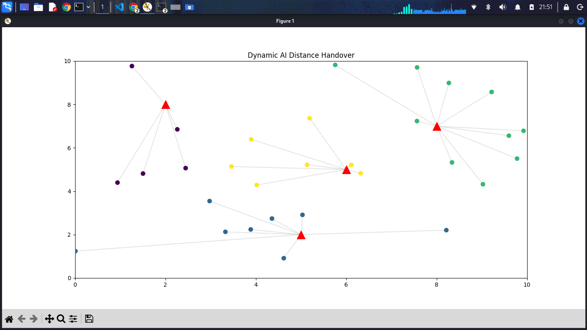

# Cell Tower Load Optimization Lab

the Heuristic focuses on Hard Constraints (Capacity) while the AI focuses on Network Stability (Handover Minimization).

### 🛠️ Getting Started
1. Clone the repository.
2. Create a virtual environment: `python -m venv .venv`
3. Activate it: `source .venv/bin/activate`
4. Install dependencies: `pip install -r requirements.txt`
5. Run the simulation: `python scripts/AI_Dynamic_Handover.py`

**Objective:** Simulating user distribution to understand Handover and Load Balancing.

**Tools:** Python, NumPy, Matplotlib, Scikit-learn, Virtual Environments.

**Features:** 
- Implemented Distance-Based Cell Association
- Calculated "Average Connection Distance" as a proxy for signal quality
- Load Balancing & Congestion Management.

**Logic:**
1. Implemented a capacity and distance-constrained assignment algorithm.
2. Then Modified it to be AI-driven. The AI ensures there are a minimum of handovers to optimize the network by calculating the centroid of the clusters on each frame.

**Theoretical Concepts Mastered**
- #### Voronoi Partitioning & Cell Boundaries
    By using K-Means clustering, the network naturally performs Voronoi Tessellation. This mathematically defines the "service area" of each tower. In a real 5G deployment, this allows for dynamic sectorization where cell boundaries shift based on where users actually are, rather than remaining as static hexagons.
- #### Handover Hysteresis & The "Ping-Pong" Effect
    A major challenge in high-speed mobility is the Ping-Pong Effect, where a user at the edge of two cells rapidly switches back and forth, wasting signaling resources.
        - This AI model demonstrates Handover Hysteresis, it doesn't switch the user immediately just because they are 1 meter closer to a new pylon.
        - By maintaining cluster centroids, the AI ensures a "Handover Margin," prioritizing a stable connection over aggressive switching.
        

