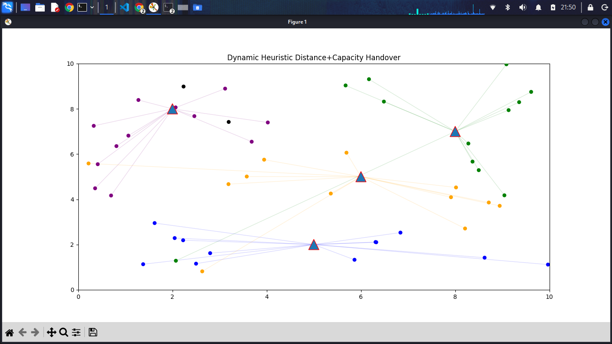

# Cell Tower Load Optimization Lab

### 📊 Network Simulation in Action

| **Dynamic Load Balancing** |
| :---: |
|  |
| *Real-time assignment showing capacity-constrained handovers* |

### 🛠️ Getting Started
1. Clone the repository: `git clone https://github.com/s0fian3/Network-Load-Optimization.git`
2. Create a virtual environment: `python -m venv .venv`
3. Activate it: `source .venv/bin/activate`
4. Install dependencies: `pip install -r requirements.txt`
5. Run the simulation: `python scripts/Heuristic_Capacity_Handover.py`

**Objective:** Simulating user distribution to understand Handover and Load Balancing.

**Tools:** Python, NumPy, Matplotlib, Virtual Environments. 

**Features & Logic:** 
- **Distance-Based Association:** Users automatically seek the nearest pylon to maximize *RSRP* (Reference Signal Received Power).
- **Capacity-Aware Rerouting:** Implements a "failover" logic. If the closest tower reaches its *MAX_CAPACITY*, the system automatically scans for the next best available pylon, preventing cell congestion.
- **Handover Analytics:** Tracks the frequency of connection switches as users move through the environment.
- **Congestion Monitoring:** Real-time calculation of "Blocked" users who cannot find an available slot within the network.

**Key Performance Indicators (KPIs)**
- **Average Connection Distance:** A proxy for Path Loss, lower values indicate better overall signal quality across the network.
- **Handover Count:** Measures the stability of the association logic.
- **Congestion Rate:** The percentage of users dropped or "Out of Service" when total demand exceeds the infrastructure's capacity.

**📝 Project Conclusion**
The simulation proves that while distance is the primary factor in network quality, Capacity Management is the ultimate governor of user experience. This heuristic approach provides a stable, predictable baseline for managing high-density traffic in urban environments.